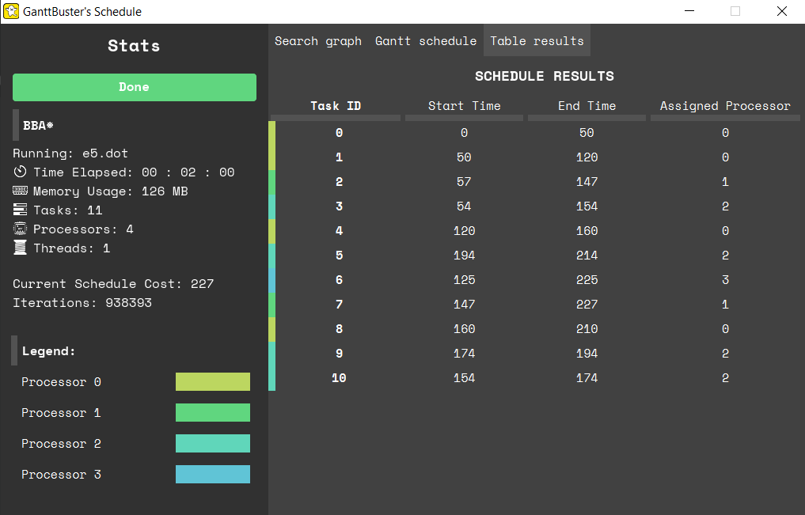

# GanttBuster Scheduler 
Welcome to the official page of Group 3's Parallel Scheduling Project for SOFTENG 306.

## Project brief
This project is about using artificial intelligence (AI) and parallel processing power to solve a difficult scheduling problem. The project is to develop a branch-and-bound type algorithm that solves the above described scheduling problem optimally for small input graphs. To achieve the highest possible performance, you also need to parallelise this branch-and-bound algorithm so that it itself uses mutliple processes to speed up the search. Using an exhaustive search method can take long, even for small graphs and when done in parallel. Henece, in spirit of good software engineering, the user needs to be provided with a live visual feedback about the search. The visualization needs to live update with the search in progress and can have interactive elements. The presented information should be meaningful and a reflection of the search. 

## Screenshots and images

## How to run it

To run the application, type the following command into command prompt (Windows) or terminal (Linux) :  
``java -jar schedular.jar [INPUT DOT FILE] [NUM PROCESSORS] -o [OUTPUT DOT FILE] -p [NUM THREADS FOR ALGORITHM]``

Required Arguments
- `[INPUT DOT FILE]` - A task graph with integer weights in dot format
- `[NUM PROCESSORS]` - The number of processors to be visualised

Optional Arguments
- `-p [NUM THREADS FOR ALGORITHM]`  - Specify the number of cores for execution in parallel (default is sequential)
- `-o [OUTPUT DOT FILE]` - Output file is named OUTPUT (default is INPUT-output.dot)

Required Specifications
- Java 8, Windows or Linux OS

## Github Username to UPI Mapping

| Username      | UPI       | Full Name             |
| ------------- | --------- | --------------------- | 
| [harmanlamba](https://github.com/harmanlamba) | hlman132 | Harman Lamba |
| [itsercleung](https://github.com/itsercleung) | eleu033 | Eric Leung |
| [preetpatel](https://github.com/PreetPatel) | ppat504 | Preet Patel |
| [jainalgandhi](https://github.com/JainalGandhi) | jgan963 | Jainal Gandhi |
| [gargi-bansal](https://github.com/gargi-bansal) | gban550 | Gargi Bansal |
| [salma-s](https://github.com/salma-s) | ssan631 | Salma Sanad |
